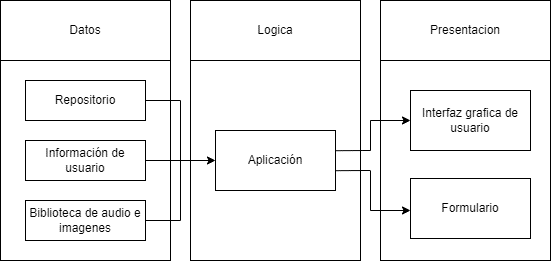
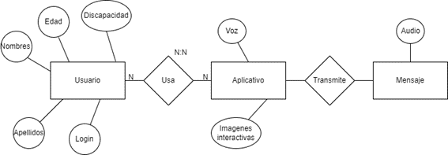
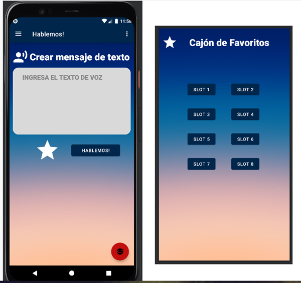
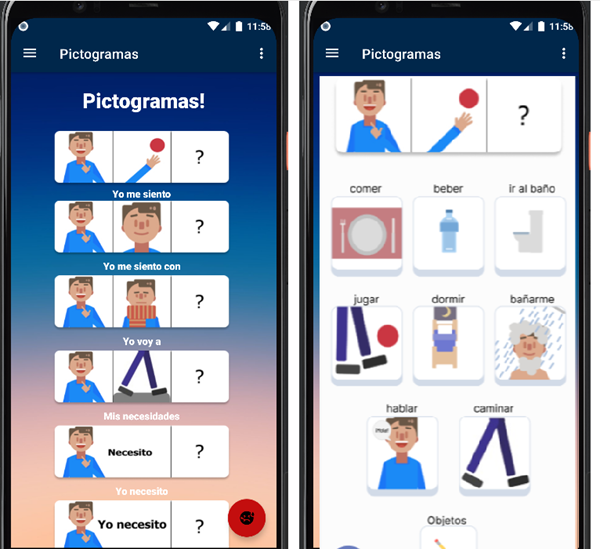
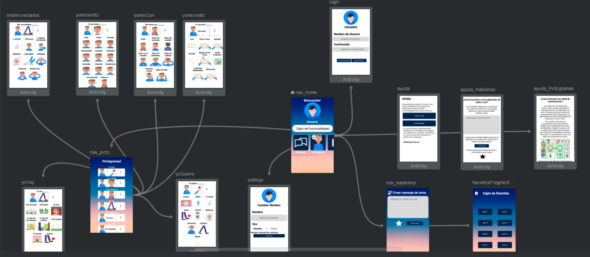
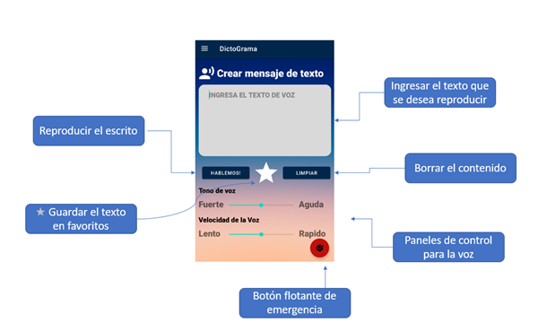

# DictoGrama
EN

## Description

DictoGrama is a mobile application designed to assist people with disabilities in communication. The second version of this app, known as DictoGrama, includes significant improvements in accessibility for people with speech difficulties.

### Team Members

- JUSTIN JOSEPH BRIAN ATUSPARIA VASQUEZ
- FERNANDO ALEJANDRO DE LA CRUZ AJALCRIÑA
- JAIRHSINIO ERICSON HUARACA RETUERTO
- OLIVER DANIEL MALPARTIDA CUSTODIO
- DIEGO ALONSO MIÑANO LAVADO
- FERNANDO FELIX PROAÑO CHOQUE
- ALEXANDER MAXIMO YAURIMA NAVARRO

### Date

September 2022  
Lima – Peru

## Contents

1. [Introduction](#introduction)
2. [Objectives](#objectives)
3. [Scope](#scope)
4. [Project Management](#project-management)
5. [System Analysis](#system-analysis)
6. [System Design](#system-design)
7. [System Development](#system-development)
8. [Documentation](#documentation)

## Introduction

The National Specialized Survey on Disability, ENEDIS 2012, estimated that 5.2% of the national population has some form of disability. This project aims to leverage technological advances to create a mobile app that facilitates communication for people with disabilities, using touch screens and voice recognition.

## Objectives

### General Objective

Develop a mobile application capable of facilitating communication for people with disabilities, allowing them to convey emotions, information about needs, and alerts.

### Specific Objectives

- Improve the quality of life for people with disabilities.
- Facilitate efficient communication with their interlocutors.
- Update pictograms with intuitive icons for patients with ASD.
- Design content in Colombian Sign Language.
- Create a module for searching signs by text and voice.

## Scope

- Reliable communication with the user.
- Understanding the needs of people with disabilities.
- Review of past purchases related to the user's disability.

## Project Management

### Resources

- Mobile app developers using Java in Android Studio
- UX/UI Designer
- QA Analysts
- Project Director
- Development and Testing Teams
- Budget and contingency reserve

### Activities

- Project planning and management
- Quality control and monitoring
- Requirements and configuration management

### Risk Management

- Identification and mitigation of technical and operational risks.

## System Analysis

### Functional Requirements

- User registration
- Communication between deaf-mute individuals via a bot
- SOS button for emergencies
- Classification according to disability type
- Interactive images read by a bot
- Modification of user profile

### Non-Functional Requirements

- Compatibility with Android 8.0 and above
- Operation on screens 4'' or larger
- Offline functionality
- Storage of up to 50 quick messages
- Use of device cache

## System Design

### Architecture Design

### Entity/Relationship Design

### Prototypes

### Application Views

- Home / Help / Settings Screen
- Text-to-Speech Manual / Pictogram Manual
- Speak / Favorites Interface
- Pictograms / Pictogram Selection

### Navigation Diagram

## System Development

### Web Service Endpoints

### Application Source Code

### Executed Application

## Documentation

### Manuals

#### Function Selection

In the main menu, you can choose between four functions:

- **Speak**: To communicate specific messages.
- **Pictograms**: For people with ASD who use pictograms.
- **Help**: Useful information for users or guardians.
- **Settings**: To add emergency contact numbers.

#### Speak

Designed for people with aphonia or mutism. Allows writing messages and converting them to audio.

#### Pictograms

Intended for patients with ASD. Uses intuitive pictograms for communication.

#### User Manual

Summary of the app’s features and functions.

#### Settings

Allows adding emergency contact numbers.

---

**Note:** This documentation is subject to change as improvements and updates are made to the application.
### DictoGrama
ES

## Descripción

DictoGrama es una aplicación móvil diseñada para asistir a personas con discapacidad en la comunicación. La segunda versión de esta aplicación, conocida como DictoGrama, incluye mejoras significativas en accesibilidad para personas con dificultades del habla.

### Integrantes

- JUSTIN JOSEPH BRIAN ATUSPARIA VASQUEZ
- FERNANDO ALEJANDRO DE LA CRUZ AJALCRIÑA
- JAIRHSINIO ERICSON HUARACA RETUERTO
- OLIVER DANIEL MALPARTIDA CUSTODIO
- DIEGO ALONSO MIÑANO LAVADO
- FERNANDO FELIX PROAÑO CHOQUE
- ALEXANDER MAXIMO YAURIMA NAVARRO

### Fecha

Septiembre 2022  
Lima – Perú

## Contenido

1. [Introducción](#introducción)
2. [Objetivos](#objetivos)
3. [Alcance](#alcance)
4. [Gestión del proyecto](#gestión-del-proyecto)
5. [Análisis del sistema](#análisis-del-sistema)
6. [Diseño del sistema](#diseño-del-sistema)
7. [Desarrollo del sistema](#desarrollo-del-sistema)
8. [Documentación](#documentación)

## Introducción

La Encuesta Nacional Especializada sobre Discapacidad, ENEDIS 2012, estimó que el 5.2% de la población nacional cuenta con alguna discapacidad. Este proyecto busca aprovechar los avances tecnológicos para crear una aplicación móvil que facilite la comunicación para personas con discapacidades, usando pantallas táctiles y reconocimiento de voz.

## Objetivos

### Objetivo General

Desarrollar una aplicación móvil capaz de facilitar la comunicación para personas con discapacidad, permitiendo transmitir emociones, información de necesidades y alertas.

### Objetivos Específicos

- Mejorar la calidad de vida de personas con discapacidad.
- Facilitar una comunicación eficiente con sus interlocutores.
- Actualizar pictogramas con iconos intuitivos para pacientes con TEA.
- Diseñar contenidos en lenguaje de señas colombiano.
- Crear un módulo de búsqueda de señas por texto y voz.

## Alcance

- Comunicación fiable con el usuario.
- Comprensión de las necesidades de las personas con discapacidad.
- Revisión del historial de adquisiciones relacionadas con la discapacidad del usuario final.

## Gestión del Proyecto

### Recursos

- Programadores de aplicaciones móviles con Java en Android Studio
- Diseñador UX/UI
- Analistas QA
- Director del proyecto
- Equipos de desarrollo y pruebas
- Presupuesto y reserva de contingencia

### Actividades

- Planificación y gestión del proyecto
- Seguimiento y control de calidad
- Gestión de requisitos y configuración

### Gestión de Riesgos

- Identificación y mitigación de riesgos técnicos y operativos.

## Análisis del Sistema

### Requerimientos Funcionales

- Registro de usuario
- Comunicación entre sordomudos a través de un bot
- Botón SOS para emergencias
- Clasificación según el tipo de discapacidad
- Imágenes interactivas leídas por un bot
- Modificación del perfil de usuario

### Requerimientos No Funcionales

- Compatibilidad con Android 8.0 y superior
- Funcionamiento en pantallas de 4'' o mayores
- Operación sin conexión a internet
- Almacenamiento de hasta 50 mensajes rápidos
- Uso de memoria caché del celular

## Diseño del Sistema

### Diseño de Arquitectura

### Diseño Entidad / Relación

### Prototipos

### Vistas de la Aplicación

- Pantalla de Inicio / Ayuda / Configuración
- Manual de Texto a Voz / Manual de Pictogramas
- Interfaz Hablemos / Favoritos
- Pictogramas / Selección de Pictograma

### Diagrama de Navegabilidad

## Desarrollo del Sistema

### Endpoints de Servicios Web

### Código Fuente de la Aplicación Móvil

### Aplicación Ejecutada

## Documentación

### Manuales

#### Selección de Función

En el menú principal, puedes seleccionar entre cuatro funciones:

- **Hablemos**: Para comunicar mensajes concretos.
- **Pictogramas**: Para personas con TEA que usan pictogramas.
- **Ayuda**: Información útil para usuarios o apoderados.
- **Configuración**: Para añadir números de confianza.

#### Hablemos

Diseñado para personas con afonía o mutismo. Permite escribir mensajes y convertirlos en audio.

#### Pictogramas

Pensado para pacientes con TEA. Utiliza pictogramas intuitivos para la comunicación.

#### Manual de Usuario

Resumen de las características y funciones de la aplicación.

#### Configuraciones

Permite agregar números de confianza para emergencias.

---

**Nota:** Esta documentación está sujeta a cambios conforme se realizan mejoras y actualizaciones en la aplicación.

